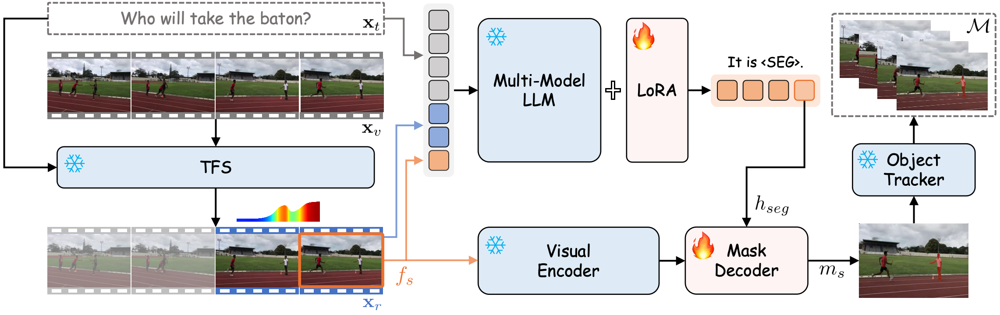

# VISA: Reasoning Video Object Segmentation via Large Language Model

<font size=7><div align='center' >
[](https://github.com/cilinyan/VISA)
[](http://arxiv.org/abs/2407.11325)
[](https://github.com/cilinyan/ReVOS-api)
</div></font>

<div align=center>

</div>

## Performance

<div style="text-align: justify;">
  VISA demonstrates remarkable proficiency in handling complex segmentation tasks that require: (a) reasoning based on world knowledge; (b) inference of future events; and (c) a comprehensive understanding of video content.
</div>

<div align=center>

</div>

## Installation
```shell
pip install -r requirements.txt
pip install flash-attn --no-build-isolation
```

## Training and Validation

### 1. Training Data Preparation

Before training, please download the datasets, and then configure the path in [dataset_config.py](utils/dataset_config.py).

#### (a) LISA's Dataset

Follow [LISA](https://github.com/dvlab-research/LISA/tree/main) to prepare LISA's datasets. The dataset folder should be stored in the `$LISA_ROOT` folder.

```
LISA_ROOT
├── ade20k
├── coco
├── cocostuff
├── llava_dataset
├── mapillary
├── reason_seg
├── refer_seg
└── vlpart
```

#### (b) Chat-UniVi's Dataset

Follow [Chat-UniVi/Chat-UniVi-Instruct](https://huggingface.co/datasets/Chat-UniVi/Chat-UniVi-Instruct/tree/main) to prepare `Chat-UniVi-Instruct` datasets. The dataset folder should be stored in the `$ChatUniVi_ROOT` folder.
```
ChatUniVi_ROOT
├── Fine-tuning
│   ├── MIMIC_imageonly
│   └── VIDEO
└── ScienceQA_tuning
```

#### (c) RVOS's Dataset

1. Reasoning Video Segmentation Datasets: [ReVOS](https://github.com/cilinyan/ReVOS-api).
2. Referring Video Segmentation Datasets: [Ref-Youtube-VOS](https://github.com/wjn922/ReferFormer/blob/main/docs/data.md), [Ref-DAVIS17](https://github.com/wjn922/ReferFormer/blob/main/docs/data.md), [MeViS](https://github.com/henghuiding/MeViS).
3. Open-Vocabulary Video Instance Segmentation Dataset: [LV-VIS](https://github.com/haochenheheda/LVVIS/tree/main).
  
   Download `mask_dict.json` and `meta_expressions.json` from [OneDrive](https://mailsjlueducn-my.sharepoint.com/:f:/g/personal/yancl9918_mails_jlu_edu_cn/EttXAjMV8yFJhHMQwX3mIw0B_o7e58YWthNnEGCQL2LlsA?e=VnWcoZ) or [BaiduPan](https://pan.baidu.com/s/1LOWPnuxXF_LXGSL7osRptA?pwd=visa). Then, put the annotations files in the `$RVOS_ROOT/lvvis/train` directory as follows.
```
RVOS_ROOT
├── ReVOS
│   ├── JPEGImages 
│   ├── mask_dict.json             
│   ├── mask_dict_foreground.json   
│   ├── meta_expressions_train_.json 
│   └── meta_expressions_valid_.json 
├── lvvis
│   └── train
|       ├── JPEGImages
|       ├── mask_dict.json
|       └── meta_expressions.json
├── Ref-Youtube-VOS
├── davis17
└── mevis
```

### 2. Pre-trained weights

#### (a) Chat-UniVi

To train VISA-7B or 13B, you need to download Chat-UniVi weights from [Chat-UniVi-7B](https://huggingface.co/Chat-UniVi/Chat-UniVi) and [Chat-UniVi-13B](https://huggingface.co/Chat-UniVi/Chat-UniVi-13B).

#### (b) SAM

Download SAM ViT-H pre-trained weights from the [link](https://dl.fbaipublicfiles.com/segment_anything/sam_vit_h_4b8939.pth).

### 3. Training VISA

```shell
# Training VISA-7B
bash scripts/train_7b.sh 

# Extracting fp32 consolidated weights from a zero 1, 2 and 3 DeepSpeed checkpoints.
cd /PATH/TO/VISA-7B/ckpt_model && python zero_to_fp32.py . ../pytorch_model.bin

# Merge LoRA Weight
CUDA_VISIBLE_DEVICES="" python merge_lora_weights_and_save_hf_model.py \
  --version Chat-UniVi/Chat-UniVi \
  --weight /PATH/TO/VISA-7B/pytorch_model.bin \
  --save_path /PATH/TO/VISA-7B/hf_model
```

### 4. Validation

1. Using `VISA` to generate predicted mask of each video
    ```shell
    bash scripts/val_7b_video.sh ${EVAL_DATASET}
    ```
2. Using [LLaMA-VID](./LLaMA-VID/) to generate target frame for each video
   - Run http_server_mp.py to build the API server for LLaMA-VID
      ```shell
      python utils_llamavid/llamavid_server.py \
          --vision_tower /PATH/TO/eva_vit_g.pth \
          --image_processor /PATH/TO/openai/clip-vit-large-patch14 \
          --model-path /PATH/TO/YanweiLi/llama-vid-13b-full-224-video-fps-1
      ```
   - Using the API for inference
      ```shell
      python utils_llamavid/llamavid_client.py \
          --video_root /PATH/TO/ReVOS/JPEGImages \
          --data_json_file /PATH/TO/ReVOS/meta_expressions_valid_.json
      ```
3. Using [XMem](https://github.com/hkchengrex/XMem) for mask propagation
4. Evaluate ReVOS's performance
    ```shell
    cd tools
    python eval_revos.py ${PRED_DIR} [ARGS]
    ```

## Cite

If you find this project useful in your research, please consider citing:

```
@article{yan2024visa,
      title={VISA: Reasoning Video Object Segmentation via Large Language Models}, 
      author={Yan, Cilin and Wang, Haochen and Yan, Shilin and Jiang, Xiaolong and Hu, Yao and Kang, Guoliang and Gavves, Efstratios},
      journal={arXiv preprint arXiv:2407.11325},
      year={2024}
}
```

## Acknowledgement
This work is built upon the [LLaVA](https://github.com/haotian-liu/LLaVA), [SAM](https://github.com/facebookresearch/segment-anything), [LISA](https://github.com/dvlab-research/LISA), [Chat-UniVi](https://github.com/PKU-YuanGroup/Chat-UniVi), [MeViS](https://github.com/henghuiding/MeViS) and [LLaMA-VID](https://github.com/dvlab-research/LLaMA-VID).
